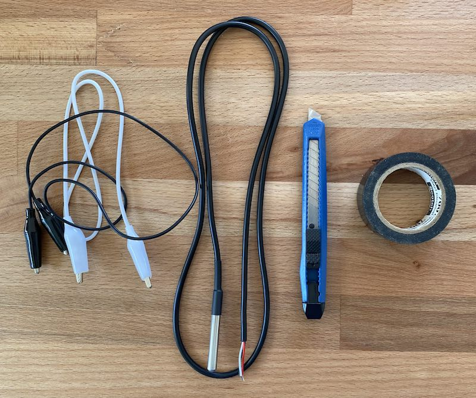
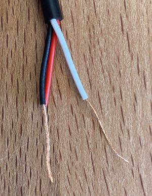
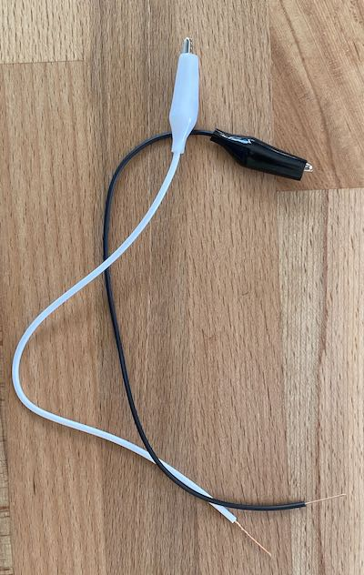
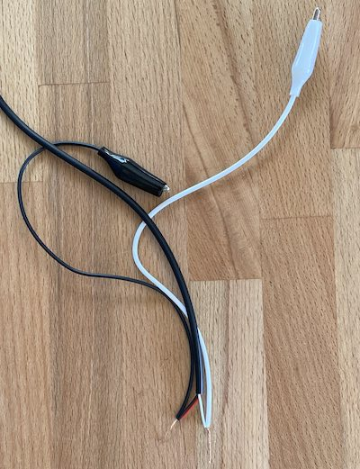
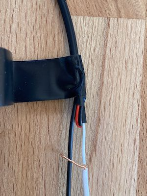
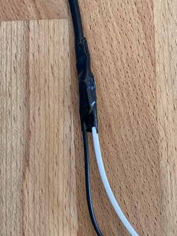
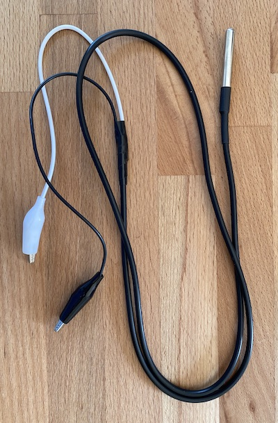

# dstemp


This extension allows the micro:bit to use the Dallas Semiconductor DS18B20 temperature sensor with just two wires (parasitic power mode).

### ~ alert

#### Not all DS18B20s are DS18B20s

There are a lot of fake DS18B20s.  This [site](https://github.com/cpetrich/counterfeit_DS18B20) lists several of the symptoms common in inauthentic sensors. It also lists official distributors. It's recommended you purchase from a recognized distributor.  This module was developed using sensors from [YourDuino](http://www.yourduino.com/sunshop/index.php?l=product_detail&p=151)

### ~

# Hardware

This module supports use of one or more DS18B20 temperature sensors.  Each sensor must be connected to a separate pin and must be configured for parasite power mode, where the sensor's power and ground are both connected to ground.

Common wiring is:

- Micro:bit GND to GND (black wire) and Vdd (red wire) of the sensor
- Micro:bit I/O pin, like `||P0||`, to the data in/out (white wire) of the sensor

You can assemble your own alligator clip version of the sensor quite easily with: 1) (authentic) DS18B20, 2) 1-2 Alligator clips, 3) Wire cutters or utility knife, and 4) Tape (electrical taper preferred)

## Building a sensor assembly

You can build a sensor assembly that easily clips on to the micro:bit cheaply (under about $7 U.S.) and quickly (under 15 minutes).

1. Assemble the materials (sensor, alligator clips (black and white preferred), wire cutters or utility knife, and tape):<br />
2. Strip approximately 1 inch of insulation from the three wires on the sensor:<br /><br /> 
   1. You can gently "roll" the wire under the blade of the utility knife to cut the insulation and then pull it off.  Be careful not to apply too much pressure or you'll cut the wires too!
   2. Twist together the red and black wires.
3. Cut the alligator clips into two. Strip approximately 1 inch of insulation from the ends of two clips of different color.<br />
4. Twist together the sensor's red/black wires with the black alligator clip.  Twist the sensor's white wire with the white alligator clip. <br />
5. Fold back the black/red wires to double them up with the larger cable on the sensor and then wrap them in electrical tape to cover all exposed wire. <br />
6. Now fold back the white wires and also wrap them in tape.<br />

A completed module looks like:<br />

The sensor's red/black wire (here connected to a black clip wire) should be connected to the `GND` on the micro:bit. The Sensor's other wire (probably white and connected to the white clip wire here) should be connected to an I/O pin on the micro:bit, like `||P0||'.

# Getting the Temperature

```sig
dstemp.celsius(pin: DigitalPin) : number 
```

Get the current temperature in Celsius.  Returns `-Infinity` on error.
# Errors


```sig
dstemp.sensorError(errCallback: (ErrorMessage: string, ErrorCode: number, Port: number) => void) { 
```

Report on any errors

- `ErrorMessage` will be a string describing the error
- `ErrorCode` will be a numeric code
- `Port` will indicate which specific port encountered the error (if multiple sensors are connected)

# Recommended usage

It's best to capture the temperature in a variable and only use it if the value isn't `-Infinity`.  Since -300 C is below absolute zero, ensuring the temperature is over -300 is sufficient.  For example:

```block
temp = dstemp.celsius(DigitalPin.P0)
if (temp > -300) {
    basic.showString("" + (temp))
}
```

```package
microbit-dstemp-2wire=github:bsiever/microbit-dstemp-2wire
```


<script src="https://makecode.com/gh-pages-embed.js"></script>
<script>makeCodeRender("{{ site.makecode.home_url }}", "{{ site.github.owner_name }}/{{ site.github.repository_name }}");</script>
